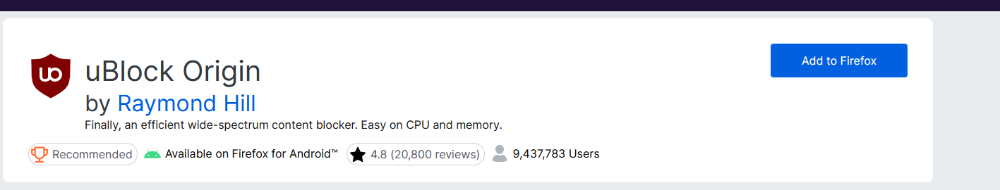

# Simplified Windows 11 Setup Guide for Beginners

## Step 1: Debloat Windows 11
1. Download the debloat tool:
   - Visit [Win11Debloat Releases Page](https://github.com/Raphire/Win11Debloat/releases)
   - Click `Get.ps1` under "Assets" to download
    
2. Run the tool:
   - Open your downloads folder.
   - Right-click `Get.ps1` → "Run with PowerShell"
    
   - Press `A` + Enter when prompted about execution policy
    
   - Select `Option 1` + Enter when menu appears
    

## Step 2: Install Firefox & uBlock Origin
1. Install browser:
   - Download Firefox from [official site](https://www.firefox.com)
    
   - Run installer with default settings
2. Add ad-blocker:
   - Open Firefox → Click the burger menu ≡ (top-right menu)
    
   - Select "Settings" → "Extensions & Themes" (left sidebar)
    
   - Search for `ublock origin` → Select official extension
    
    
   - Click "Add to Firefox" → Enable for private browsing
    
    

## Step 3: Install KeePassXC Password Manager
1. Download and install:
   - Get installer from [official site](https://keepassxc.org/download/#windows)
    
   - Run installer → Follow prompts (check "Create shortcut")
    
    
2. Create password database:
   - Open KeePassXC → Click "Create New Database"
   - Name your database (e.g., "My Passwords")
   - Set MASTER PASSWORD (remember this!):
     • Use a memorable and funny sentence, for example: `The loliPOPS love jumping 5 fences!`
     • This will be your ONLY essential password
   - Save database in easy location (e.g., Desktop)
   - Add logins: Click `+` button to save new entries

## Step 4: Adjust Privacy Settings
1. Open Settings:
   - Press Windows key → Type `settings` → Enter
    
2. Disable tracking:
   - Go to "Privacy & security" → "General"
     → Toggle OFF all options
    
   - Select "Diagnostics & feedback"
     → Toggle OFF all options
   - Select "Activity history"
     → Toggle OFF all options → Click "Clear history"
    

## Step 5: Disable Notifications
- Right-click notifications icon (bottom-right taskbar)
- Select "Turn off all notifications" or disable individually
    

## Step 6: Restart Your Computer

## Caveats
This does not turn your Windows into a bastion of security. It only makes it slightly more secure. Alternatives exist if you need more security than this.
